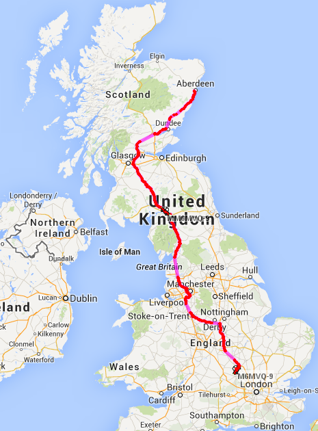
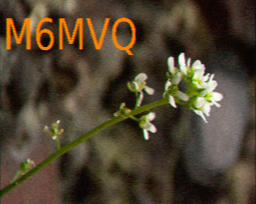
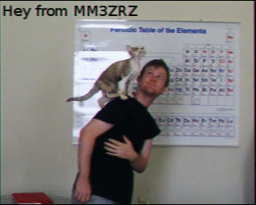

# EMF2014 - Report

This page documents what really happened in 2014 for the village at EMF. It is currently a work in progress.

## The Travel Project

<blockquote>During the drive from Aberdeen to EMF, irl MM6MVQ and hibby MM3ZRZ will be on-the-air on either a 5W handheld or 10W mobile. We will be using either M(M)6MVQ/M or M(M)3ZRZ/M depending on who it is operating the radio and which country we are in at that point in the journey. We will QSL (direct) for contacts made during the journey if requested.</blockquote>

On the journey to EMF we were indeed on the air using irl's Baofeng UV-5R and a magmount 2m/70cm antenna on the roof. On our journey we spoke to:

| Callsign | Name    | Frequency       | Rough Location         |
| -------- | ------- | --------------- | ---------------------- |
| MM0CEY   | Pete    | 145.550 Simplex | South of Edinburgh     |
| MM0YEQ   | Gordon  | GB3CS           | Glasgow Area           |
| ZI4JR    | ?       | GB3MI           | Mancheter/ Puerto Rico |

<small> The last contact was not easily readable at all. Pretty certain we got this callsign wrong. It might have been KP4JR which is a valid callsign in the correct location.</small>

----

<blockquote> You will be able to track our journey (where we are in range of an IGate) as we will be transmitting APRS position reports. The callsigns for this will be MM6MVQ-9 while in Scotland and M6MVQ-9 in England. The equipment that will be used for APRS is still to be decided, but hopefully it will be possible for this to also be message capable.</blockquote>

We were also transmitting APRS position reports although unfortunately they were not via RF but only via APRS-IS. Here you can see a map of our journey:

## The Village

When we arrived our spot already had tents in it. This was to be expected as we only arrived at around 6pm and others had been there since very early that morning. We found enough room to get our tents pitched and got set up.

It was only on Saturday that we got our power and data hooked up (thanks to the guy that let us hang our power off his tent as the Datenklo was full) and we did then get the toastie maker and various battery-powered devices that desperately needed charging plugged in.

We very quickly discovered that we were missing two things: lights and tables. The table that we had was devoted to kitchen things in order to keep the food off the ground and to set up the radio equipment we had we taped up the ends of the gazebo box and let the equipment sit on that. It did turn out to be quite a nice table although it was difficult to operate the equipment without sitting on the floor.

For lighting, we tied a couple of torches to the gazebo poles and then added some reflectors into the roof. It worked enough that no one got trodden on but it left a lot of room for improvement.

We didn't really spend enough time in our village for it to be worth putting too much effort into it. The Cisco IP phone we had for our fieldphone extension was never even plugged in, but as irl was the only other person with a phone and SIM it probably wouldn't have been much use to us.

[campGND](http://www.campgnd.com/) was originally intended as a trial run for an event like EMF but after what we had learnt from campGND a lot of things in the plan had changed and there were now a lot of new bugs to iron out. Everything stayed waterproof and no equipment was lost or damaged and so it could have been a lot worse, but we will definitely be making a few changes the next time we attend a hacker camp.

## Projects

### Video Streaming and Lightning Talk

adventureloop streamed Stage C on Saturday using HTTP Live Streaming, an HTTP-based media streaming communications protocol implemented by Apple Inc. as part of their QuickTime, Safari, OS X, and iOS software.

Whilst the official streaming organised by volunteers from the BBC worked great on desktop platforms, it wasn't so good on mobile platforms. Both Android and iOS have built in support for HTTP Live Streaming and so it was possible on Saturday for mobile users to view some of the talks. On desktop platforms, it was also possible to view the streams using VLC.

During the lightning talks session on Saturday, adventureloop gave a talk about HTTP Live Streaming and why, even though there is already streaming provided, it can sometimes be a good idea to duplicate effort and reinvent the wheel in order to have progress.

### Adventuremate

<blockquote>We will be making and giving away a club mate 'like' adventureMate. A drink released under a CC0 license, available for all to make their own with simple equipment. adventureloop and hibby will be producing batches of the mate throughout the weekend.</blockquote>

This happened. The recipie can be found [here](http://adventurist.me/adventuremate.txt).

'''More things could be written here.'''

### SSTV Recieving Station

<blockquote>To encourage a bit of SSTV at EMF, [[User:irl|irl]] will be running an SSTV recieving station that will be uploading images recieved to the Internet. Depending on the amount of free time [[User:irl|irl]] has, these will either just be on a webpage, or also tweeted to a dedicated Twitter account too.</blockquote>

Whilst the station was set up, not enough effort was put into getting the word out and it wasn't used. Next time there will need to be more collaboration with the [[Villages:Amateur Radio|amateur radio village]] and the Twitter integration really would be good for getting the project noticed and generating interest.

The station did work perfectly though and the two images sent by irl and hibby were successfully uploaded to the Internet.

### Toasties

More things could be written here.

### For next time

More things could be written here.
